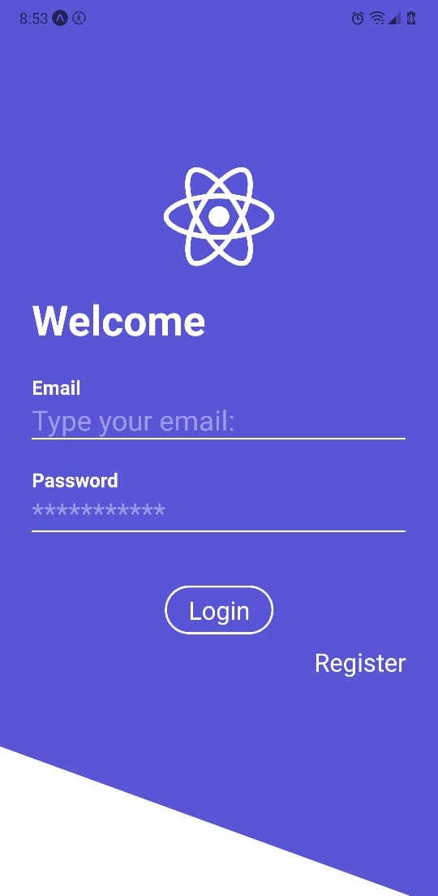

# Products App!

- Proyecto de prueba con expo-cli, una app con 2 configuraciones de navegación (Auth y Main)
- incluye customs hooks para formularios y para consumir una api interna
- usa expo-image-picker para interacturar con la camara y la galeria
- use expo-camera para crear una instancia de la camara customizada (creada por el desarrollador)

Snaps:
1. Login Screen:

  

2. Register Screen:

  

3. Products List Screen:

  

4. Product Detail Screen:

  

 
 
 
 

This examples are part from the [React Native: Aplicaciones nativas para IOS y Android course](https://www.udemy.com/course/react-native-fh/)